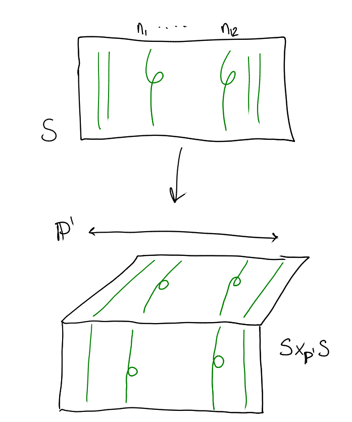
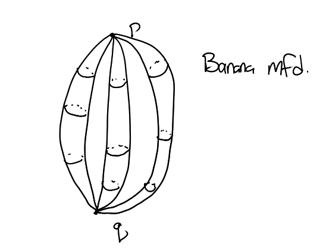
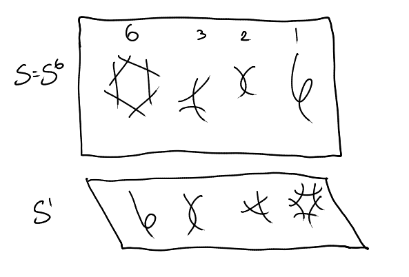

**Definition**: A compact complex Kahler manifold $X$ of dimension $d$ is Calibi-Yau if $c_1(TX)=0$, where $c_1$ is the first Chern class (i.e. $\det T^\dual X = K_X \cong X\cross\CC$, i.e. the canonical is trivial) $\iff$ there exists a holomorphic global $d\dash$form $\iff$ there exists a Ricci flat Kahler metric and $h^{k, 0}(X) = 0$ unless $k=0,d$.

- If $d=1$, $X$ is an elliptic curve, topologically only one type (a torus)
- If $d=2$, $X$ is a $K3$ surface, topologically only one type
- If $d=3$, $X$ is a CY-threefold, there are >5 million

There are two interesting Hodge numbers:
- $h^{1,1}(X)$: the dimension of the Kahler cone, or dually the number of independent holomorphic curve classes
  - Never zero if Kahler
- $h^{2,1}(X)$: the space of independent infinitesimal complex deformations
- Mirror symmetry swaps these two

**Definition**: A rigid CY3 $X$ has $h^{2,1}(X)=0$.

Interested in a few aspects of CY3s:

- What combinations of values $(h^{1,1}, h^{2,1})$ are possible?
  - Mirror symmetry falls out of tabulating these
  - Physicists interested in small ones
- How small can these combinations be? (By summing these two numbers)
- Can we compute the Donaldson-Thomas/Gromov-Witten/"string partition functions" (generating functions for counts of curves)
  - What are the modular properties of these functions?
- Arithmetic: rigid CY3s over $\QQ$ are modular forms (much like Wile's theorem showing elliptic curves are modular)

Today: 

- Construct rigid CY3s (banana manifolds) of (0,4) and (0,2)
- Compute Donaldson-Thomas partition function and associated Gromov-Witten potential, a genus 2 Siegal modular form of weight $2g-2$.
- Compute the modular forms ($L\dash$series)

## The Generic Banana Manifold

Start with a generic hypersurface $S \subset \CP^2\cross \CP^1$ of degree $(3,1)$. Projecting onto $\PP^2$ yields $Bl_{9\text{pts}}\CP^2$, onto $\PP^1$ yields an elliptic fibration (projects onto an elliptic curve) which has 12 nodal fibers. 

Now to make a threefold: take the fiber product $\hat X = S \cross_{\PP^1} S$ which has 12 conifold singularities, which we can resolve by taking $X = Bl_\Delta(\hat X)$, where $\Delta$ is the diagonal. This yields a CY3 with $h^{2,1}(X) = 8, h^{1,1}(X) = 20$. The fibers are generically products of elliptic curves $E\cross E$, which has 12 singular fibers.

(Note that we're blowing up along a Cartier divisor and not a Weil divisor, which gives the singularities local resolutions.)

We also have $E_\text{sing} = \CC{\units}\cross \CC\units \cross B$ where $B=C^1 \union C^2 \union C^3$ where $C_i = \PP^1$ and $C_i \intersect C_j = \theset{p,q}$ and $N = \OO(-1)\oplus \OO(-1)$. This thing is a toric variety?

We can do enumerative geometry here by looking at the fibers of $X \mapsvia{\pi} \PP^1$, where $\beta \in \ker \pi \cong \ZZ^3 = H_2(X; \ZZ)$ is given by $\beta = d_1[c_1] + d_2[c_2] + d_3[c_3]$. Can write out a generating function $Z^{DT}(Q_1, Q_2, Q_3, p)$ where the coefficients are the DT invariants, i.e. the virtual count of curves given by the holomorphic euler characteristic. This expands to a product where the coefficients and exponents are themselves coefficients of modular forms. The exponents appearing are the fourier coefficients of a specific modular form?

The associated GW potentials are genus 2 Siegel modular forms $F$ of weight $2g-2$. Can think of this as a function on the moduli space of genus 2 modular curves, and the weight is like the Chern class?

A rigid example: start with an extremal elliptic surface $S^6$:

This is the universal family for moduli of elliptic curves with a 6-torsion point, and has a $\ZZ/6\ZZ$ action. Let $S'$ be a base change that reverses the order of the fibers, and take $S\times_{\PP^1}S'$. The $\ZZ/6\ZZ$ action is now free and this is a $6\times 4$ conifold. If we blow up the quotient along these points to get an $X_6$, this is a rigid CY3 where $X\mapsvia{\pi} \PP^1$ has 3 banana fibers and 1 section, $h^{2,1}=0$, and $h^{1,1} = 4$. The theorem (in progress) is that $Z$ of these fibers is similar to the previous one, and the $F_q$s are now Siegel for certain congruent subgroups of $\mathrm{Sp}_2(\ZZ)$.

As it turns out, there was an additional $\ZZ/2\ZZ$ action, yielding a $\ZZ/12\ZZ$, and quotienting by this yields 2 banana fibers and 2 doubled fibers which are each $\PP^1$ bundles over a special elliptic curve. Moreover, this is tied for the smallest one, at $h^{2,1} = 0, h^{1,1} = 2$.

Where does the modularity come from? Topological vertex, Schur functions, but not satisfying -- we don't have good explanations of where this should be coming from.

There aren't any threefolds where we can completely compute the partition functions, we have a hard time computing with the sections (although the fibers are okay).
